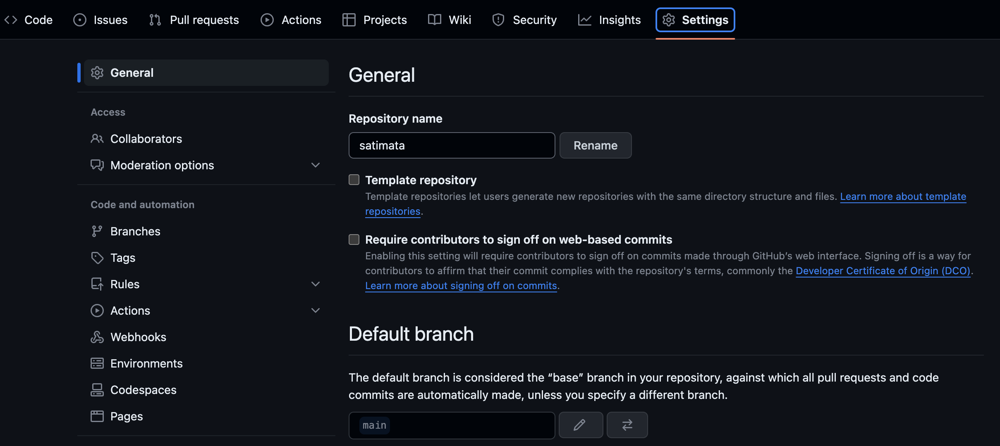
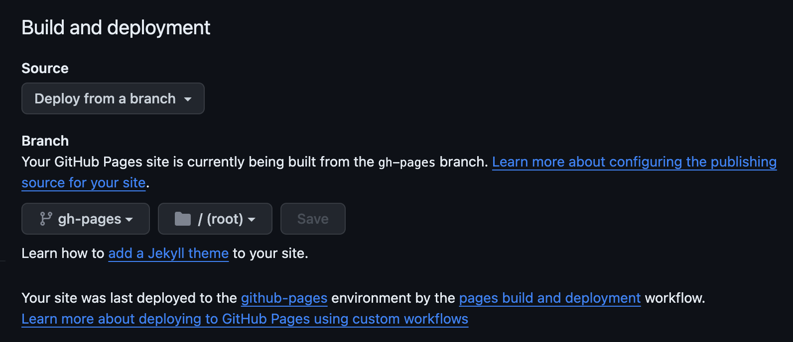
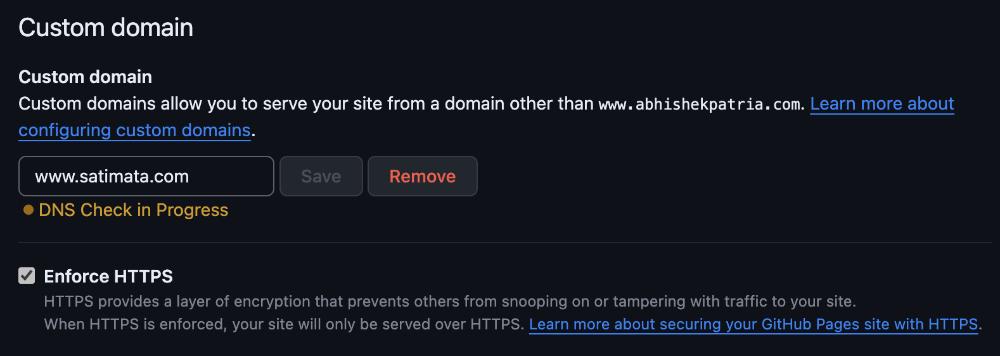

# Satimata React Application

This application serves the purpose of providing information about the Satimata Temple of Yagnapur (Jahazpur), Rajasthan, India.

The project uses [Gatsby](https://github.com/gatsbyjs/gatsby), which is a static site generator for React.
It includes `@mui/material` and its peer dependencies, including [Emotion](https://emotion.sh/docs/introduction), the default style engine in Material UI v5.

Deployment is taken care using Github Pages feature.

## Prerequisites

The following programs need to be installed on the machine to work with the code:
- node >= 18.18.1 (Preferably using nvm)
- npm
- yarn
- git

## Branches

This repository contains two branches:
1. main - This branch is used to write code in React using the Gatsby Framework with React MUI theme with custom changes
2. gh-pages - This branch is used to actually deploy the application to Github by translating the React based application to Github Pages version. Also, known as the deployment branch

 - Important: 
   - Github Pages only allows you to host a static website. This means that there is NOT going to be any server side rendering and the pages served would be static.
   - Please remember NOT to mix the code of the deployment branch into the main branch and vice versa as this is going to lead to unpredictable behavior
   - Add the following to your ".gitconfig" file

     ```zsh
     [http]
     	postBuffer = 104857600
     	lowSpeedLimit = 0
     	lowSpeedTime = 999999
     ```
     
## Steps to follow

1. Clone the repo (https://github.com/patriaabhishek/satimata.git):

<!-- #default-branch-switch -->

2. Change the working directory to the repository and checkout the main branch. Then run the following commands in sequence mentioned below

    ```zsh
    cd satimata
    git checkout main
    npm install
    ```

3. For local development and making the necessary changes, you should run the following command

    ```zsh
    npm run develop
    ```

4. For deployment on Github pages, please run the following command
   
    ```zsh
    npm run deploy
    ```

   It will perform the following steps:
   1. Build the application using React and Gatsby
   2. Translate the website into a Github Pages website in the public folder
   3. Push the changes into the gh-pages branch
   4. Start the remote build process using Github Actions

5.  For ensuring that the application is properly deployed, please perform the given steps.
    1.  Go to the settings of your repository

        


    2.  On the left side, click on the "Pages" section. In the "Build and deployment" section, ensure that the deployment branch is set to "gh-pages" and folder for deployment is set to "/root". Remember to click on the save button.

        

    3. Put the custom domain name in the "Custom Domain" section and save it!

        
